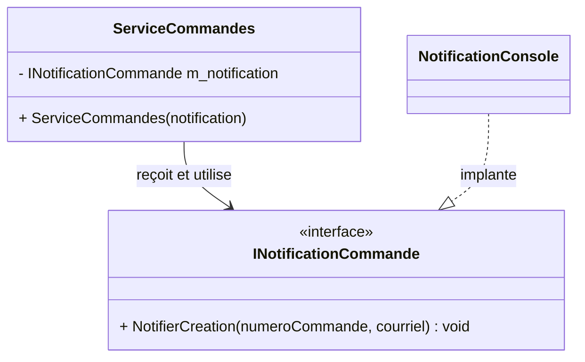

# Exercice 1

## Mission et durée

Environ 100 minutes. Rendez la notification substituable, comparez deux façons
d’assembler les objets et vérifiez la collaboration avec une doublure manuelle,
puis avec Moq. Le cas d’utilisation ne doit plus construire ni connaître
`NotificationConsole`.

## Parcours Git

Dans le dépôt Git de l’exercice, créez la branche d’intégration `dev` depuis la
branche `main`. Créez ensuite la branche de fonctionnalité
`fonctionnalite/notification-abstraite` depuis `dev`, puis publiez-la sur le
dépôt GitHub. Revoyez la fiche Git de la semaine 3 pour les commandes.

## Travail demandé

1. Dans le projet principal `S04E01E03_Restaurant_Qualite`, créez l'interface
   étroite `INotificationCommande`.
2. Faites implanter cette interface par la classe `NotificationConsole`.
3. Ajoutez un paramètre de type `INotificationCommande` au constructeur de la
   classe `ServiceCommandes` et refusez une valeur `null`.
4. Dans le fichier `Program.cs` du projet Terminal, assemblez d’abord les
   objets manuellement en appelant directement leurs constructeurs.
5. Conservez cette version et refaites le même assemblage avec
   `Host.CreateApplicationBuilder(args)`, `AddScoped`, `Build`, `CreateScope`
   et `GetRequiredService`.
6. Justifiez le cycle de vie choisi et gardez l’utilisation de
   `IServiceProvider` exclusivement dans le fichier `Program.cs` du projet
   Terminal.
7. Dans le projet de tests, créez une classe espion manuelle qui implante
   `INotificationCommande` et mémorise le dernier numéro de commande ainsi que
   le dernier courriel transmis à sa méthode de notification.
8. Dans le projet de tests, écrivez un premier test avec cette classe espion,
   puis un test équivalent avec `Mock<INotificationCommande>`, `Verify`,
   `It.Is` et `Times.Once`.

<details>
<summary>Rappel des semaines précédentes — injection et conteneur</summary>

Revoyez [l’injection manuelle](../semaine-03/E02-injection-manuelle.md)
et [le conteneur](../semaine-03/E03-conteneur-di.md). Le point de composition
connaît les classes concrètes. Quelle dépendance doit être `Scoped`, et pourquoi
le conteneur ne doit-il pas entrer dans le service?

</details>

<details>
<summary>Rappel des semaines précédentes — doublures et Moq</summary>

Revoyez [le simulacre manuel](../semaine-02/E03-simulacre-manuel.md), puis
[Moq](../semaine-02/E04-moq.md). Commencez par une petite classe qui implante
le contrat et conserve l’appel observé; traduisez ensuite la même intention
avec `Mock<T>`, `.Object` et `Verify`.

</details>

> [!WARNING]
> Résoudre `ServiceCommandes` depuis le conteneur dans un test unitaire cache
> les dépendances du sujet. Construisez-le directement avec sa doublure.

## Question de transfert

Avant de fusionner, répondez brièvement dans `DECISIONS.md` :

1. Qu'est-ce qui est maintenant interchangeable?
2. Qui choisit l'implantation concrète?
3. Qu'est-ce qui reste stable dans la classe `ServiceCommandes` lorsque cette
   implantation change?

La portée demeure volontairement limitée à un scénario vérifié de deux façons.
Il n’est pas nécessaire de tester `NotificationConsole`.

<details>
<summary>Repère UML — à consulter après votre première tentative</summary>

Le diagramme montre seulement la relation transformée pendant cet exercice.



**Question de lecture :** quelle flèche a changé par rapport au projet de
départ, et quelle classe concrète est maintenant remplaçable?

</details>

**Point de contrôle :** l’assemblage manuel et celui du cadriciel produisent le
même comportement, puis les deux tests passent.

```bash
dotnet run --project S04E01E03_Restaurant_Qualite/S04E01E03_Restaurant_Qualite.Terminal
dotnet run --project S04E01E03_Restaurant_Qualite/S04E01E03_Restaurant_Qualite.Terminal -- --manuel
dotnet test S04E01E03_Restaurant_Qualite/S04E01E03_Restaurant_Qualite.slnx
```

Dans le dépôt Git de l’exercice, fusionnez la branche de fonctionnalité dans la
branche `dev`, exécutez `dotnet test`, puis fusionnez la branche `dev` dans la
branche `main`. Publiez enfin les branches `dev` et `main` sur GitHub.
