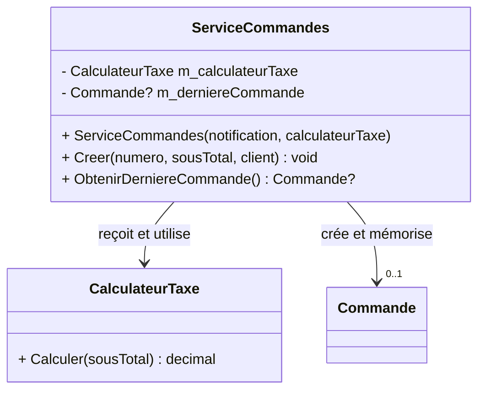

# Exercice 2

## Mission et durée

En 60 minutes, séparez le calcul de la taxe du cas d'utilisation et rendez
visibles les commandes et les requêtes.

Dans le dépôt Git de l’exercice, créez la branche de fonctionnalité
`fonctionnalite/srp-cqs` depuis la branche `dev`.

## Travail demandé

1. Dans le projet principal, extrayez le calcul de la taxe dans une nouvelle
   classe nommée `CalculateurTaxe`.
2. Ajoutez un paramètre de type `CalculateurTaxe` au constructeur de la classe
   `ServiceCommandes` afin d’y injecter ce collaborateur.
3. Changez le type de retour de la méthode `Creer` de la classe
   `ServiceCommandes` de `Commande` à `void`. Cette méthode de commande doit
   continuer à créer la commande, à la mémoriser dans `m_derniereCommande` et à
   envoyer la notification, mais elle ne doit plus retourner la commande créée.
4. Conservez la méthode de requête `ObtenirDerniereCommande()` dans la classe
   `ServiceCommandes`. Elle doit retourner la dernière commande mémorisée sans
   modifier l’état du service.
5. Conservez sans les modifier les deux méthodes de test d’interaction créées à
   l’exercice 1. Dans le projet de tests, ajoutez exactement deux **nouvelles**
   méthodes de test :
   - un test du calcul de taxe pour un sous-total de 40 $;
   - un test prouvant que la requête retourne la dernière commande créée,
     notamment son numéro et son sous-total.
6. Expliquez dans `DECISIONS.md` pourquoi les deux classes ont des raisons de
   modification différentes et en quoi la requête respecte CQS.

Dans le fichier `Program.cs` du projet Terminal, mettez ensuite à jour **les
deux fonctions d’assemblage** pour fournir une instance de `CalculateurTaxe` au
constructeur de `ServiceCommandes`. Adaptez aussi le code appelant : appelez
d’abord la méthode de commande `Creer(...)`, puis obtenez la commande à afficher
avec la méthode de requête `ObtenirDerniereCommande()`. Le code déjà vu n’est
pas redonné étape par étape.

Rappel des semaines précédentes

L’assemblage manuel appelle directement les constructeurs. L’assemblage avec
le cadriciel déclare les associations avant `Build`, puis résout le service
dans une portée. Quel cycle de vie convient à un calculateur sans état?

Repère UML — à consulter après votre première tentative

Le diagramme montre seulement les éléments touchés par SRP et CQS. La
dépendance vers `INotificationCommande`, introduite à l’exercice 1, demeure en
place même si elle n’est pas répétée ici.

**Question de lecture :** quelle méthode est une commande, quelle méthode est
une requête et quelle responsabilité a quitté `ServiceCommandes`?

Dans le dépôt Git de l’exercice, fusionnez la branche
`fonctionnalite/srp-cqs` dans la branche `dev` et exécutez les tests. Fusionnez
ensuite la branche `dev` dans la branche `main`, puis exécutez de nouveau les
tests sur `main`.

> [!TIP]
> **Tests déjà présents :** les deux tests de notification de l’exercice 1.
> **Tests à ajouter ici :** un test de `CalculateurTaxe` et un test de la
> requête `ObtenirDerniereCommande()`. Ne retestez pas la notification : ce
> comportement est déjà couvert.
