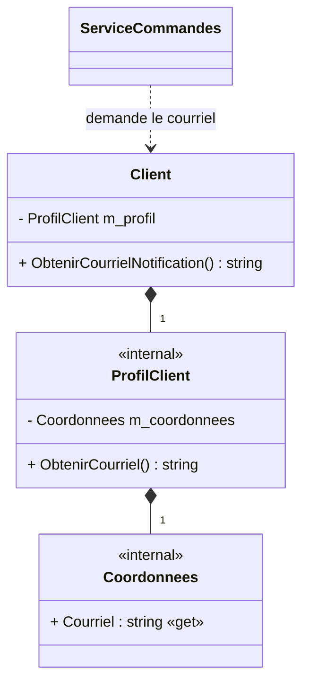

# Exercice 3

## Mission et durée

En 60 minutes, retirez la chaîne d'appels utilisée pour obtenir l'adresse de
notification du client.

Dans le dépôt Git de l’exercice, créez la branche de fonctionnalité
`fonctionnalite/demeter` depuis la branche `dev`.

## Travail demandé

Le code de départ permet un appel semblable à
`commande.Client.Profil.Coordonnees.Courriel`. Ajoutez plutôt un message utile
sur l'objet connu directement par le service.

1. Dans le projet principal, ajoutez à la classe `Client` une méthode qui
   fournit le courriel à utiliser pour la notification.
2. Rendez les propriétés donnant accès aux objets `ProfilClient` et
   `Coordonnees` non publiques lorsqu’elles ne sont plus nécessaires à
   l’extérieur de leurs classes.
3. Modifiez la méthode `Creer` de la classe `ServiceCommandes` pour qu’elle
   envoie la notification en communiquant seulement avec ses collaborateurs
   directs, notamment l’objet `Client`.
4. Dans le projet de tests, écrivez un test avec la classe espion manuelle qui
   vérifie le courriel transmis à la méthode de notification, sans tester
   directement la structure interne de la classe `Client`.
5. Dans le projet de tests, écrivez le test équivalent avec Moq et vérifiez
   qu’aucun autre appel à l’interface `INotificationCommande` n’est effectué.
6. Ajoutez dans `DECISIONS.md` la chaîne supprimée, le message qui la remplace
   et votre comparaison entre l’espion et Moq.

Rappel des semaines précédentes

Pour un espion manuel, mémorisez seulement les valeurs nécessaires à
l’observation. Avec Moq, utilisez la valeur attendue, `Times.Once` et
`VerifyNoOtherCalls`. Quel comportement observable doit rester identique entre
les deux tests?

> [!WARNING]
> N’utilisez pas Moq pour remplacer `Client`, `ProfilClient` ou `Coordonnees`.
> Ce sont de petits objets déterministes; construisez-les réellement.

Repère UML — à consulter après votre première tentative

Le diagramme se concentre sur le nouveau chemin de communication. Les classes
`ProfilClient` et `Coordonnees` existent toujours, mais elles ne sont plus
exposées comme chemin de navigation public.

**Question de lecture :** quel message remplace la chaîne de propriétés, et
quelle partie de la structure interne du client peut maintenant changer sans
modifier `ServiceCommandes`?

Dans le dépôt Git de l’exercice, fusionnez successivement la branche
`fonctionnalite/demeter` dans la branche `dev`, puis la branche `dev` dans la
branche `main`. Exécutez `dotnet test` sur chaque branche de destination après
la fusion.
