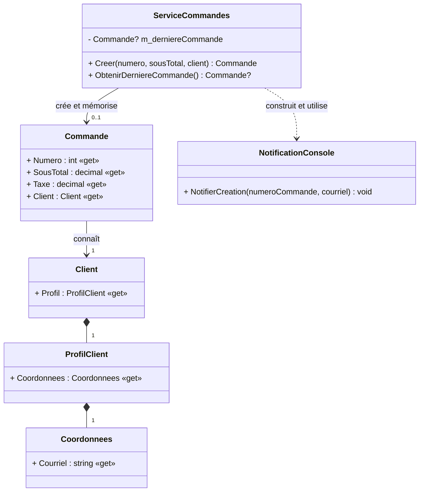

# Semaine 4 — Qualité du code et inversion des dépendances

Cette semaine poursuit le projet de restaurant avec un atelier évolutif. Les
trois exercices utilisent la même solution cumulative pendant environ
**3 h 15 en classe**; une finition de **45 à 60 minutes** peut être demandée à
la maison.

## Parcours des deux séances

| Moment | Progression dans l’atelier |
|---|---|
| Séance de 3 h | Diagnostic, substitution, assemblage manuel et premier point de contrôle |
| Séance de 2 h | Assemblage avec le cadriciel, SRP, CQS, loi de Déméter et comparaison des tests |
| Maison, au besoin | Terminer les tests et la justification dans `DECISIONS.md` |

Les estimations détaillées totalisent environ **4 h 10** de travail. Elles
incluent les points de contrôle et la rédaction, mais excluent les courtes
présentations et les retours collectifs faits en classe.

| Étape | Activité |
|---|---|
| [Exercice 1](./E01-substitution-dip.md) | Substituer une dépendance, comparer assemblage manuel/cadriciel et espion/Moq |
| [Exercice 2](./E02-srp-cqs.md) | Séparer les responsabilités et distinguer commandes et requêtes |
| [Exercice 3](./E03-loi-demeter.md) | Réduire une chaîne d’appels et consolider les tests d’interaction |

Le départ compilable se trouve dans
[`S04E01E03_Restaurant_Qualite`](./S04E01E03_Restaurant_Qualite/).

## Diagramme du projet principal au départ

Ce diagramme montre les classes de production avant le premier réusinage. Le
projet Terminal assemble et exécute ces objets; le projet de tests les vérifie.
Ces deux projets sont volontairement absents du diagramme afin de garder le
modèle lisible.

**Question de lecture :** quelles relations rendent actuellement
`ServiceCommandes` difficile à tester ou trop curieux de la structure de ses
collaborateurs?

Dans le dépôt Git de l’atelier, chaque exercice se réalise dans une branche de
fonctionnalité nommée `fonctionnalite/...` et créée depuis la branche
d’intégration `dev`. Revoyez les commandes Git de la semaine 3 au besoin.
Avant chaque fusion de branches, exécutez les tests et vérifiez la branche Git
active avec `git status`.
